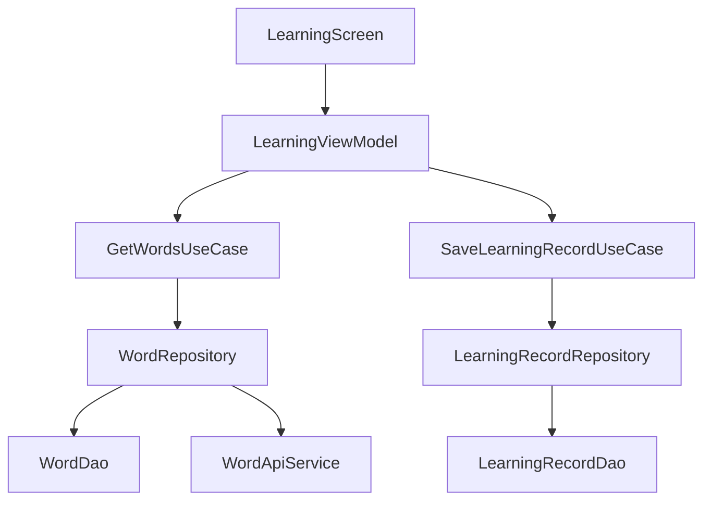

# Android 架构规范

## 1. 架构概述

本项目采用**分层架构**设计，遵循现代Android开发最佳实践，确保代码的可维护性、可测试性和可扩展性。

### 1.1 核心架构层次

```
┌─────────────────┐
│     UI层        │
├─────────────────┤
│   Domain层      │
├─────────────────┤
│    Data层       │
└─────────────────┘
```

## 2. 各层职责

### 2.1 UI层

**职责**：
- 处理用户界面显示和交互
- 与用户直接交互的组件
- 状态管理和UI更新

**组成部分**：
- `Activity`/`Fragment`：界面容器
- `Screen`：Compose屏幕组件
- `ViewModel`：管理UI相关状态和业务逻辑
- `Navigation`：处理屏幕导航

**规范**：
- UI组件应保持简洁，主要负责显示数据和处理用户输入
- 业务逻辑应委托给ViewModel处理
- 使用Compose进行UI构建
- ViewModel应通过UseCase与Domain层交互

### 2.2 Domain层

**职责**：
- 包含核心业务逻辑
- 定义业务规则和用例
- 作为UI层和Data层之间的桥梁

**组成部分**：
- `UseCase`：封装特定业务逻辑的用例
- `Repository`（接口）：定义数据访问抽象
- `Model`：业务领域模型

**规范**：
- 领域模型应包含业务逻辑相关的属性和方法
- UseCase应专注于单一功能，遵循单一职责原则
- Repository接口定义应与具体实现分离

### 2.3 Data层

**职责**：
- 处理数据的存储和获取
- 实现Repository接口
- 提供数据持久化和网络请求

**组成部分**：
- `RepositoryImpl`：Repository接口的具体实现
- `DataSource`：数据来源（本地数据库、网络、文件等）
- `Entity`：数据库实体
- `Mapper`：数据转换工具

**规范**：
- 数据层应负责数据的获取、存储和转换
- 实现缓存策略，提高应用性能
- 处理网络请求和本地存储的异常

## 3. 组件设计规范

### 3.1 ViewModel

**设计原则**：
- 每个屏幕或功能模块应有对应的ViewModel
- ViewModel应通过构造函数注入所需依赖
- 使用`viewModelScope`处理协程
- 暴露`LiveData`或`StateFlow`供UI观察

**示例**：
```kotlin
class LearningViewModel(
    private val getWordsUseCase: GetWordsUseCase,
    private val saveLearningRecordUseCase: SaveLearningRecordUseCase
) : ViewModel() {
    private val _words = MutableLiveData<List<Word>>()
    val words: LiveData<List<Word>> get() = _words
    
    fun loadWords() {
        viewModelScope.launch {
            _words.value = getWordsUseCase.execute()
        }
    }
}
```

### 3.2 Repository

**设计原则**：
- 定义清晰的接口，描述数据操作
- 实现类负责具体的数据获取和存储逻辑
- 处理不同数据源的切换和合并

**示例**：
```kotlin
interface WordRepository {
    suspend fun getWords(level: WordLevel): List<Word>
    suspend fun saveWord(word: Word)
    suspend fun getFavoriteWords(): List<Word>
}

class WordRepositoryImpl(
    private val wordDao: WordDao,
    private val apiService: WordApiService
) : WordRepository {
    // 实现方法...
}
```

### 3.3 UseCase

**设计原则**：
- 每个UseCase应专注于单一业务功能
- 接收输入参数，返回处理结果
- 处理业务规则和逻辑

**示例**：
```kotlin
class GetWordsUseCase(private val wordRepository: WordRepository) {
    suspend operator fun invoke(level: WordLevel): List<Word> {
        return wordRepository.getWords(level)
    }
}
```

## 4. 依赖注入

**实现方式**：
- 使用Hilt进行依赖注入
- 模块化组织依赖配置
- 按功能和层次划分Module

**规范**：
- 遵循构造函数注入原则
- 合理划分Module，提高可维护性
- 避免循环依赖

**示例**：
```kotlin
@Module
@InstallIn(SingletonComponent::class)
object DatabaseModule {
    @Provides
    fun provideDatabase(@ApplicationContext context: Context): AppDatabase {
        return Room.databaseBuilder(
            context,
            AppDatabase::class.java,
            "whyme.db"
        ).build()
    }
    
    @Provides
    fun provideWordDao(database: AppDatabase): WordDao {
        return database.wordDao()
    }
}
```

## 5. 数据存储

**存储方案**：
- 使用Room进行本地数据库存储
- 使用DataStore进行键值对存储
- 考虑使用WorkManager处理后台任务

**规范**：
- 数据库实体应与领域模型分离
- 使用DAO模式处理数据库操作
- 实现适当的索引，提高查询性能

## 6. 导航设计

**实现方式**：
- 使用Jetpack Navigation组件
- 采用单Activity多Fragment/Compose屏幕架构
- 定义清晰的导航图

**规范**：
- 使用Safe Args传递参数
- 实现合理的返回栈管理
- 处理深层链接和导航动画

## 7. 网络请求

**实现方式**：
- 使用Retrofit进行网络请求
- 结合OkHttp处理网络配置
- 使用协程处理异步操作

**规范**：
- 实现网络请求的错误处理
- 添加请求超时和重试机制
- 考虑使用缓存减少网络请求

## 8. 性能优化

**优化策略**：
- 使用RecyclerView或LazyColumn高效显示列表
- 实现图片加载的缓存和压缩
- 避免在主线程执行耗时操作
- 使用协程和线程池管理并发任务

**监控**：
- 使用Android Profiler分析性能
- 监控内存使用和CPU占用
- 检测UI卡顿和ANR

## 9. 测试策略

**测试层次**：
- 单元测试：测试独立组件
- 集成测试：测试组件间交互
- UI测试：测试用户界面和交互

**测试工具**：
- JUnit和Mockito进行单元测试
- Espresso进行UI测试
- MockWebServer模拟网络请求

## 10. 代码组织

**目录结构**：
```
app/src/main/java/com/zhoulesin/whyme/
├── data/              # 数据层
│   ├── datastore/     # DataStore相关
│   ├── local/         # 本地存储
│   ├── remote/        # 网络请求
│   └── repository/    # Repository实现
├── di/                # 依赖注入
├── domain/            # 领域层
│   ├── model/         # 领域模型
│   ├── repository/    # Repository接口
│   └── usecase/       # 业务用例
├── ui/                # UI层
│   ├── auth/          # 认证相关
│   ├── components/    # 通用组件
│   ├── favorites/     # 收藏功能
│   ├── home/          # 主页
│   ├── learning/      # 学习功能
│   ├── navigation/    # 导航
│   ├── profile/       # 个人资料
│   ├── search/        # 搜索功能
│   ├── statistics/    # 统计功能
│   └── theme/         # 主题
├── utils/             # 工具类
├── MainActivity.kt    # 主Activity
└── WhyMeApplication.kt # 应用入口
```

**命名规范**：
- 类名：大驼峰命名法（PascalCase）
- 方法名：小驼峰命名法（camelCase）
- 变量名：小驼峰命名法（camelCase）
- 常量：全大写，下划线分隔
- 包名：小写字母，点分隔

## 11. 最佳实践

1. **单一职责原则**：每个类和函数应只负责一项功能
2. **依赖倒置原则**：依赖抽象而非具体实现
3. **接口分离原则**：接口应小而专，避免臃肿
4. **组合优于继承**：优先使用组合而非继承
5. **防御性编程**：处理异常和边界情况
6. **代码复用**：提取通用功能为工具类或扩展函数
7. **文档注释**：为关键类和方法添加注释
8. **版本控制**：使用Git进行代码管理，遵循Git Flow工作流

## 12. 架构演进

**持续改进**：
- 定期审查架构设计
- 适应业务需求变化
- 采用新的技术和最佳实践
- 优化性能和用户体验

**技术栈更新**：
- 跟踪Android SDK和Jetpack组件的更新
- 评估并采用新的开发工具和库
- 保持代码库的现代化

## 13. 示例架构实现

### 学习功能流程



### 数据流向

```mermaid
flowchart LR
    UI[UI层] -->|
```