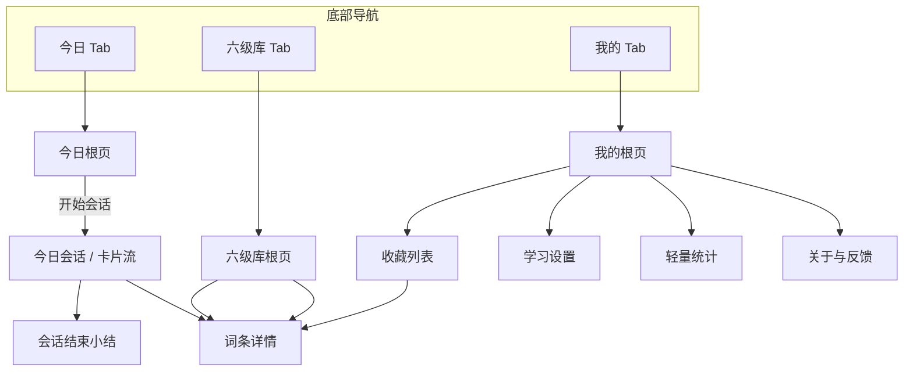

# 页面结构 · 职场六级（方案 A：三 Tab）

| 项 | 内容 |
|---|------|
| 关联 PRD | `产品需求文档-职场六级-合并版.md` |
| 方案 | **方案 A**：底部固定三 Tab（今日 / 六级库 / 我的）；**不采用** M0 单屏弱入口作为默认壳 |
| 版本 | v1.0 |
| 日期 | 2026-04-14 |
| 状态 | 草案，待评审 |

---

## 1. 顶层信息架构

底部导航 **3 个一级入口**，对应三个常驻根页面：

```
┌─────────────────────────────────────┐
│   今日    │   六级库   │    我的     │
└─────────────────────────────────────┘
```

| Tab | 根页面职责 | 产品支柱 |
|-----|------------|----------|
| **今日** | 短会话入口 + 卡片流；微完成与节奏反馈 | P1 接触、P2 理解、P4 节奏 |
| **六级库** | 唯一词表：搜索、浏览、单线进度、职场标签筛选 | P1、P2 |
| **我的** | 收藏分夹、轻统计、学习设置、关于 | P3 个人语料、P4 |

**原则**：不设独立「口语」「阅读」Tab；复习/小测/跟读等以二级入口或会话模式分期接入（见 §6）。

---

## 2. 导航关系总览



---

## 3. 各 Tab 页面结构（区块级）

### 3.1 今日 Tab

#### 3.1.1 今日根页

| 区域 | 内容 |
|------|------|
| 顶栏 | 标题「今日」；可选进入「学习设置」的入口（图标或文案） |
| 主区 | **今日进度**：微目标（如「今日 3/10 张」）；**连续接触英语天数**（一行） |
| 主按钮 | **开始今日** → 进入「今日会话」 |
| 次级（分期） | 「加练一会」；「从收藏复习」（M2 及以后） |

#### 3.1.2 今日会话（卡片流）

**建议**：进入会话后 **隐藏底部 Tab**（沉浸式），系统返回键或顶栏「返回」结束/中断会话并回到今日根页。

| 区域 | 内容 |
|------|------|
| 顶栏 | 返回；**第 n / N 张**；可选 **「职场加浓」** 状态指示 |
| 卡片区 | 词条卡 / 句块卡 / 脚本卡 / 补丁卡（分期共用同一卡片壳与不同内容模板） |
| 卡内操作 | 发音；翻面或展开释义；**红心收藏**；收藏时 **分夹**（写作 / 会前 / 补丁）—首期可默认「未分类」，在收藏列表中再编辑 |
| 底栏 | **下一张**；上一张（可选） |

#### 3.1.3 会话结束

| 形式 | BottomSheet 或全屏页二选一，产品统一即可 |
|------|------------------------------------------|
| 内容 | 「今日已接触 n 个」+ 微完成反馈文案；本轮收藏数；入口「去看看收藏」 |
| 操作 | 完成 → 回今日根页；「再来一轮」→ 再次进入会话 |

---

### 3.2 六级库 Tab

#### 3.2.1 六级库根页

| 区域 | 内容 |
|------|------|
| 搜索 | 置顶 **搜索框**（英文或中文检索策略由实现/内容定） |
| 进度 | **单线进度**：已见 / 总词数或覆盖率环 + 一行说明文案 |
| 筛选 | **Chips**：全部、写作、会议、补丁…（与内容标签一致；首期可仅「全部」） |
| 列表 | 虚拟列表：词条行（词形 + 极简义或标签）；点击进入 **词条详情** |
| 状态 | 加载中、空结果、无网络（若适用） |

#### 3.2.2 词条详情（全屏二级，多入口共用）

| 区域 | 内容 |
|------|------|
| 顶栏 | 返回；收藏 |
| 主体 | 音标、释义、例句；（分期）句块、脚本、补丁扩展区 |
| 底区（可选） | 从该词发起「今日加练」等（远期） |

---

### 3.3 我的 Tab

#### 3.3.1 我的根页

| 区域 | 内容 |
|------|------|
| 顶区 | 用户标识（可弱）；**连续接触天数**；今日是否已达微完成 |
| 统计卡片 | **六级单线覆盖率**、累计收藏数等（少而解释性强，避免复杂图表） |
| 列表入口 | **收藏**；**学习设置**；**轻量统计**（可与根页统计合并，只保留一处）；**关于与反馈** |

#### 3.3.2 收藏列表（全屏二级）

| 区域 | 内容 |
|------|------|
| 顶栏 | 返回；可选搜索 |
| 筛选 | **Top Tab 或 Chips**：写作夹 / 会前夹 / 补丁夹 / 未分类 |
| 列表 | 词条行或卡片摘要；进入 **词条详情** 或只读卡片视图（实现择一） |

#### 3.3.3 学习设置（全屏二级）

| 设置项 | 说明 |
|--------|------|
| 每次会话张数 | 如 3～10 张 |
| 职场加浓 | 开关：随机仅抽带职场标签的卡片（仍在六级词域内） |
| 学习提醒 | 本地通知时间（分期） |
| 释义展示 | 中释/英释等（若 PRD 开放问题已定） |

#### 3.3.4 轻量统计 / 关于与反馈

- **轻量统计**：会话次数、接触词数趋势等保持克制，详细数据可折叠。  
- **关于与反馈**：版本号、协议入口、反馈渠道。

---

## 4. 路由与屏幕清单（建议键名）

便于与 `NavHost`、`Screen` 路由枚举对齐（实现时可微调命名）。

| 路由键 | 说明 | Tab / 模态 |
|--------|------|------------|
| `today` | 今日根页 | 今日 |
| `today/session` | 今日会话（卡片流） | 今日；建议沉浸式、单独 back 行为 |
| `today/session/complete` | 会话结束小结 | 今日；可与 `session` 合为同一 composable 内状态 |
| `cet6` | 六级库根页 | 六级库 |
| `word/{id}` | 词条详情 | 全局二级 |
| `profile` | 我的根页 | 我的 |
| `favorites` | 收藏列表（可分 query：`folder=`） | 我的 |
| `settings/study` | 学习设置 | 我的 |
| `statistics` | 轻量统计 | 我的 |
| `about` | 关于与反馈 | 我的 |

**分期路由（不占用主导航）**：复习队列、小测、跟读等建议为 `today/session?mode=review` 或 `quiz` 等二级路由，在 M2+ 文档中再锁定。

---

## 5. 返回栈与跨 Tab 约定

1. **今日会话**：隐藏底栏；**返回** → 今日根页（会话视为结束或弹出确认，产品定一种）。  
2. **词条详情**：从「今日会话 / 六级库 / 收藏」进入时，**pop 回到来源页**，避免统一 `popUpTo` 到错误 Tab。  
3. **收藏分夹**：首次收藏可用 BottomSheet 选夹；或默认「未分类」，在收藏列表内长按/编辑改夹。

---

## 6. 与合并版 PRD 的里程碑对应（页面侧）

| 阶段 | 页面交付 |
|------|----------|
| **M0** | 三 Tab 壳 + 今日根页与会话（词条卡）+ 六级库列表/搜索（能力允许范围内）+ 我的（收藏列表基础版）+ 词条详情 |
| **M1** | 六级库单线进度、学习设置、会话结束小结、本地提醒入口 |
| **M2** | 收藏分夹与从收藏复习；句块/脚本/补丁模板在会话与详情中扩展；复习/小测二级页 |
| **M3** | 跟读/TTS、会前模式等不新增主导航 |

---

## 7. 与现有代码的映射提示（非必须同步改代码）

当前工程为「首页 / 学习 / 我的」时，可大致对应为：

| 本文 Tab | 现有模块方向 |
|----------|----------------|
| 今日 | 原首页 + 学习会话流合并为「今日」叙事 |
| 六级库 | 原学习中心中的词表/浏览/搜索能力，独立为 Tab |
| 我的 | `Profile` + `Favorites` + `Statistics` 与 PRD 入口对齐 |

具体路由重命名与 `BottomNavItem` 调整以实现时为准。

---

**文档结束**
